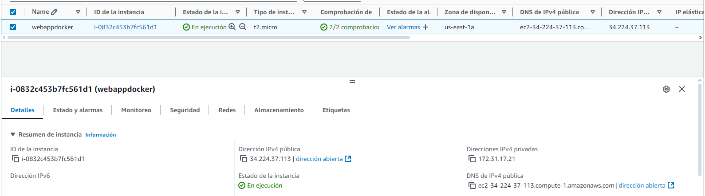

# Evidencias del lab1

Se crean los contenedores de docker locales

Se ejecutan en localhost

Se crea la instancia en ec2

Se ejecuta el docker respectivo, descargandolo de dockerhub

Se accede a la imagen desde el dns de la ec2

